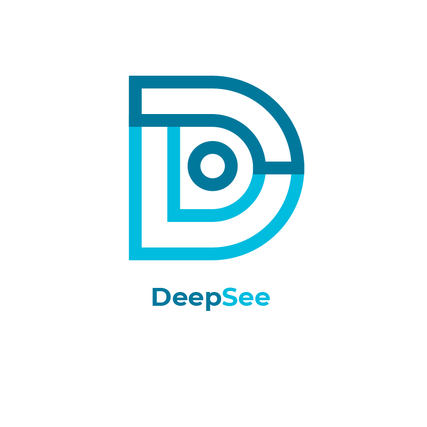
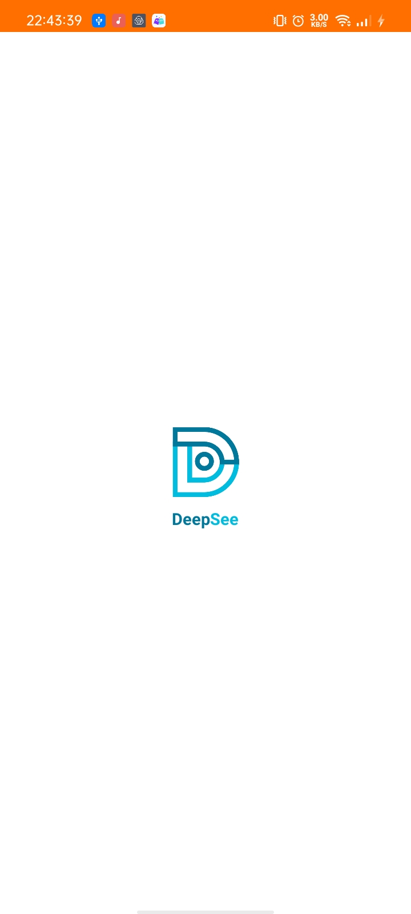
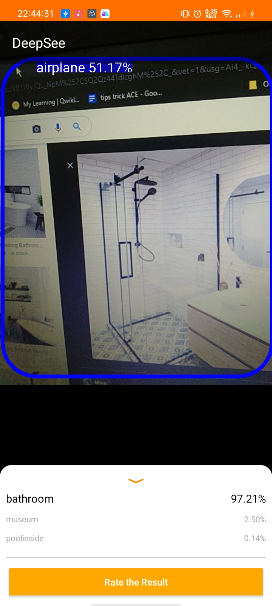
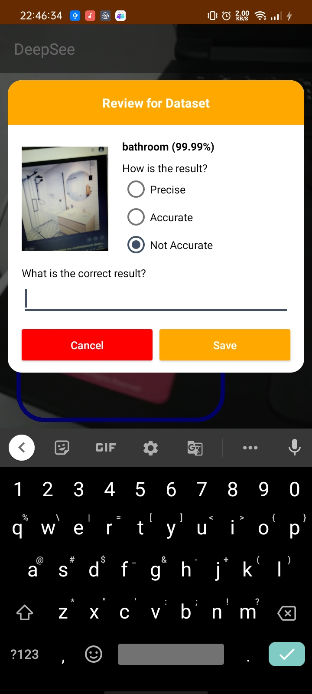
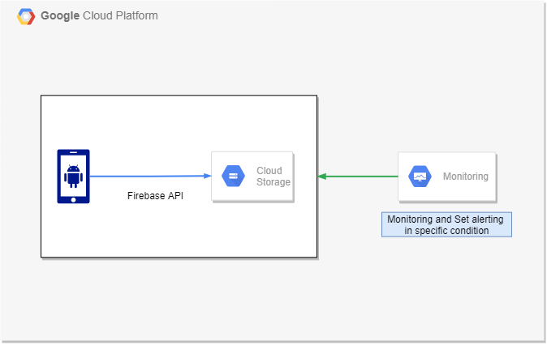

# DeepSee

There are approximately 6 million people in Indonesia who suffer a visual impairment and for that reason public infrastructure and all the surroundings still can not properly solve this problem. It is easy to take a walk to observe indoor rooms and nearby objects for people with normal vision. However, this cannot be done for persons with disabilities such as blind people, so they need a special device that can facilitate their mobility. One solution is to present technology that helps bridge the gap between the current conditions experienced by blind people and their expectations. Therefore, we developed an application called Deep See that is able to help blind people recognize unfamiliar indoor spaces and nearby objects accurately and responsively for everyday life. 

After all the research and development we have been able to done, the final result is in an android app form that can predict room kind and also object detection using a camera in mobile device. It give a voice output from speaker so it can be recognized. In addition to other user sector that does not have blindness we put an image uploading feature so that user can submit an image for dataset enrichment.  

Each path in this project has a concern that can briefly describe below :

**Machine Learning :** 
building and training models from specified dataset then convert it with TensorFlow lite form and set it in onder to fit with android environment. The datasets are from this public dataset which can be found in this link 
- http://web.mit.edu/torralba/www/indoor.html
- https://storage.googleapis.com/openimages/web/download.html

For indoor scene recognition dataset we only took some of this classes that we find the most important, as shown below :
* artstudio
* bathroom
* classroom
* computerroom
* elevator
* greenhouse
* hospitalroom
* inside_bus
* kindergarden
* laboratorywet
* library
* museum
* office
* operating_room
* poolinside
* restaurant_kitchen
* stairscase
* studiomusic
* tv_studio
* waitingroom

For object detection we only use some object classes too for the same reason :
* Table
* Chair
* Person
* Shelf
* Toilet
* Stairs

**Android:** 
Making initial app and creating structural code to integrate with ML model and cloud infrastructure

**Cloud :**
Set infrastructure for image uploading feature and set a monitoring dashboard and also create a alerting rule to improve availability and scalability. In addition to result review so we create realtime database in firebase. The resource infrastructure can be describe with this diagram below

This app is for final capstone project in order to complete BANGKIT Academy 2021. We have been given a month to finalize this app with some rules and requirements. we also want to give a credit to @Dinesh Raturi, we first see his youtube video about currency detector app with similar concept to us.

©DeepSee 2021
